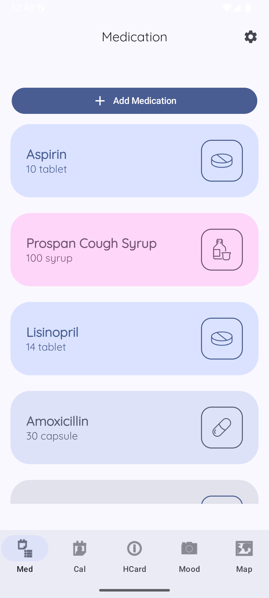
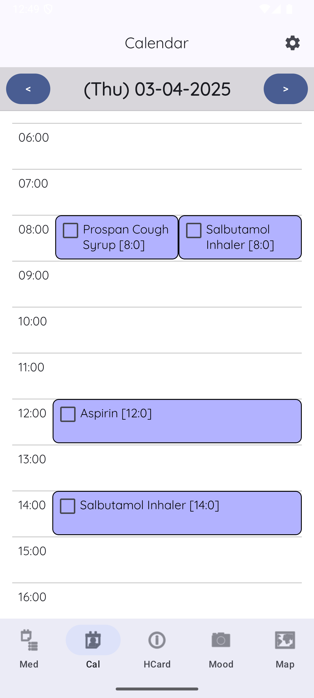
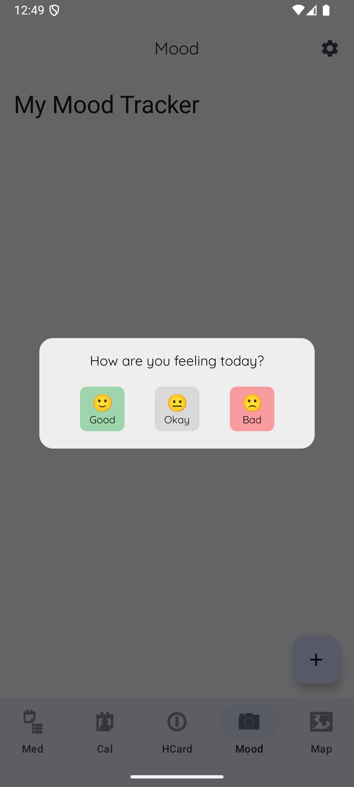
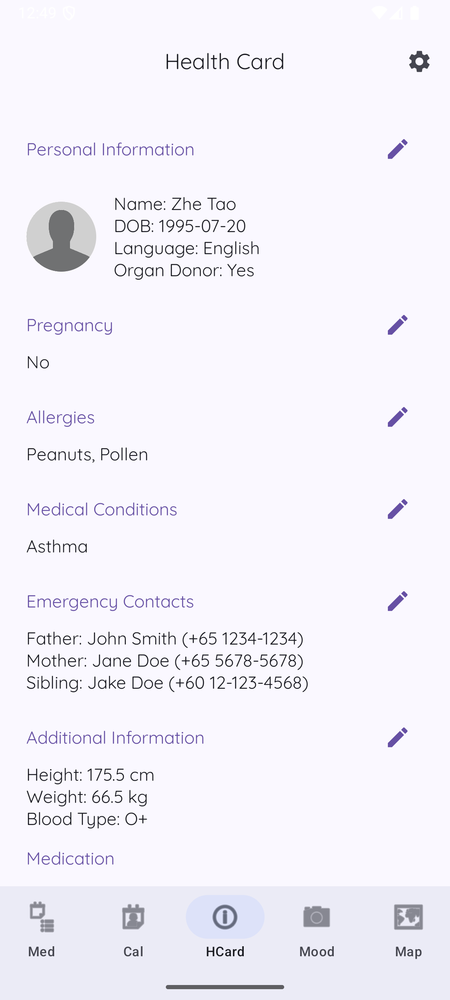
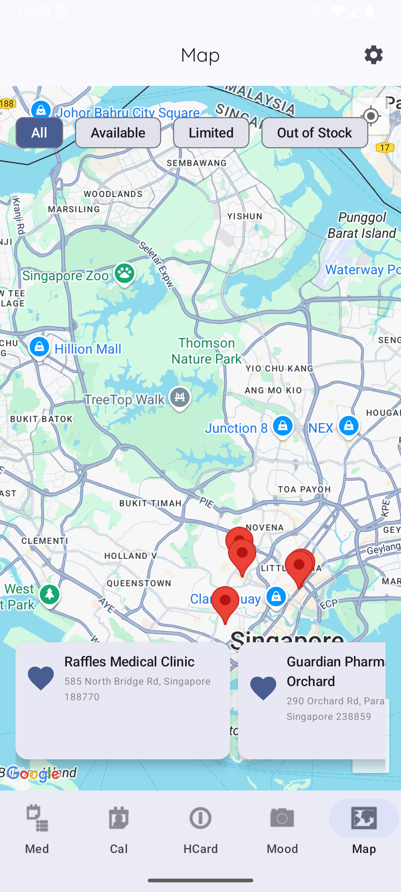

# 💊 CareSync

Caring for someone — or even just yourself — can get overwhelming. Meds get missed, routines break, stress builds.

**CareSync** is a warm, fuss-free app that helps you stay on top of medications with smart reminders and simple tracking. No more guesswork. Just timely nudges, real-time stats, and peace of mind.

Whether you're a patient or a caregiver, CareSync keeps everyone in sync — because taking meds should feel caring, not complicated.

## 🌱 Background

### 💥 Challenge Statement

<table>
  <tr>
    <td></td>
    <td>
      <em>“Half of all patients don’t take their meds as prescribed.”</em> 
      — <strong>World Health Organization</strong>  
      <em>“By 2050, 1 in 5 people will be over 60.”</em> 
      — <strong>United Nations</strong>
    </td>
  </tr>
</table>

> 👵 Aging population.
> 💊 Rising chronic illnesses.
> 💔 Missed medications.
> 👨‍⚕️ Overwhelmed caregivers.

These numbers aren’t just stats—they're **lives** at risk. And that’s where **CareSync** steps in. A gentle nudge. A caring hand. A better way to manage meds.

### 👥 User Need Statements

<table>
  <tr>
    <td>
      
    </td>
    <td>
   <h4>👩‍⚕️ Caregivers</h4>
      <ul>
        <li>Family, nurses, volunteers</li>
        <li>Need visibility into loved ones’ health</li>
        <li>Want to help, but not hover</li>
      </ul>
   <h4>🧓 Care Recipients</h4>
      <ul>
        <li>Older adults or patients with chronic conditions</li>
        <li>Need reminders and routine</li>
        <li>Want autonomy + support</li>
      </ul>
   </td>
  </tr>
</table>

## 🎨 Product Design

### 📦 Product Description

CareSync is a simple yet powerful mobile app that helps patients manage their medications — and lets caregivers stay gently informed. From medication tracking to mood monitoring, CareSync bridges the gap between healthcare needs and human care.

At its heart, CareSync is about timing, trust, and togetherness:

- 💊 Medication Tracking – Patients can log all their medications with dosage and timing details.
- 🔔 Smart Reminders – Users get nudges when it’s time to take their meds.
- 📈 Adherence Analytics – Donut charts and stats show how well patients are following their regimens.
- 😊 Mood Tracking – Users input their daily mood, visualized in a word cloud to spot emotional patterns.
- 🩺 Digital Health Card – Displays allergies, conditions, and medications in one place for emergencies or checkups.
- 🧑‍⚕️ Caregiver Access – Caregivers can view patient profiles, medication logs, and mood summaries.
- 🗺️ Nearby Pharmacies – An integrated map shows where to get medication refills quickly and easily.

Whether you're managing your own care or helping someone else, CareSync brings clarity and calm to daily health routines.

### 🖥️ System Diagram

## ✨ Features & Benefits

| 🧩 Feature             | 📝 Description                                         | 🌟 Benefit                           |
| ---------------------- | ------------------------------------------------------ | ------------------------------------ |
| 💊 Medication Tracking | Users can log medication names, dosages, and schedules | No more missed doses                 |
| 🔔 Smart Reminders     | Timely notifications based on user schedule            | Builds consistent habits             |
| 🧑‍⚕️ Caregiver Access    | Link to a caregiver who can view stats and logs        | Enables remote support               |
| 😊 Mood Tracking       | Daily mood input with cheerful visuals                 | Understands emotional well-being     |
| 🩺 Digital Health Card | Quick overview of meds, allergies, conditions          | Instant info for doctors/emergencies |
| 🗺️ Nearby Pharmacies   | Map view of nearby pharmacies and availability         | Makes refills stress-free            |

<table>
  <tr>
    <td align="center"><b>💊 Medication Tracking</b></td>
    <td align="center"><b>🔔 Smart Reminders</b></td>
    <td align="center"><b>🧑‍⚕️ Caregiver Access</b></td>
  </tr>
  <tr>
    <td></td>
    <td></td>
    <td></td>
  </tr>
  <tr>
    <td align="center"><b>😊 Mood Tracking</b></td>
    <td align="center"><b>🩺 Digital Health Card</b></td>
    <td align="center"><b>🗺️ Nearby Pharmacies</b></td>
  </tr>
  <tr>
    <td></td>
    <td></td>
    <td></td>
  </tr>
</table>

## 🛠️ Prototype Development

### 🧩 Hardware / Software Components

| Component      | Description                                |
| -------------- | ------------------------------------------ |
| 📱 Android App | Built using Jetpack Compose                |
| 🧠 ViewModels  | Handle business logic and state management |
| 🗃️ Room DB     | An abstraction layer over SQLite           |
| 📦 SQLite      | Local data persistence                     |
| 🗺️ Google Maps | Displays nearby pharmacies                 |

### 📁 Code Organization

| **Module**               | **Description**                                                                 |
| ------------------------ | ------------------------------------------------------------------------------- |
| `datasource/`            | 🔌 Handles data access logic like login states and user profiles                |
| `model/`                 | 🧠 Contains data classes, DAOs, Room databases, and repositories                |
| `ui/components/`         | 🎨 Houses UI logic including screens and reusable components                    |
| `ui/screens/`            | 📱 Split into features like `calendar`, `caregiver`, `medication`, `mood`, etc. |
| `ui/theme/`              | 🎨 Manages typography and color schemes                                         |
| `utils/`                 | 🧰 Utility functions and helper files                                           |
| `CareSyncApplication.kt` | 📦 The main application entry point for setup and initialization                |

### 🚀 Setup, Deploy, Operate

1. 🔐 **Add API Keys**

   - Add your `MAPS_API_KEY` in `local.properties`.

2. 🧪 **Run the App**
   - Open in Android Studio
   - `Run > app` or `Shift + F10`