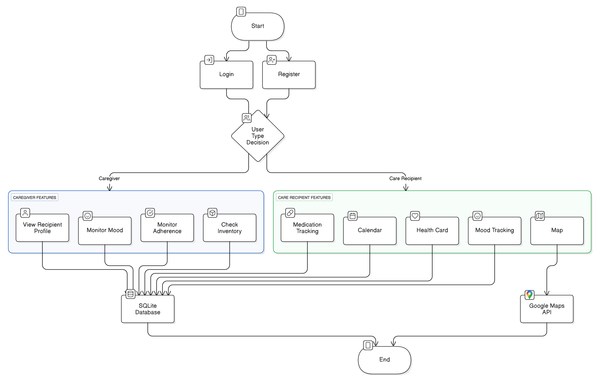
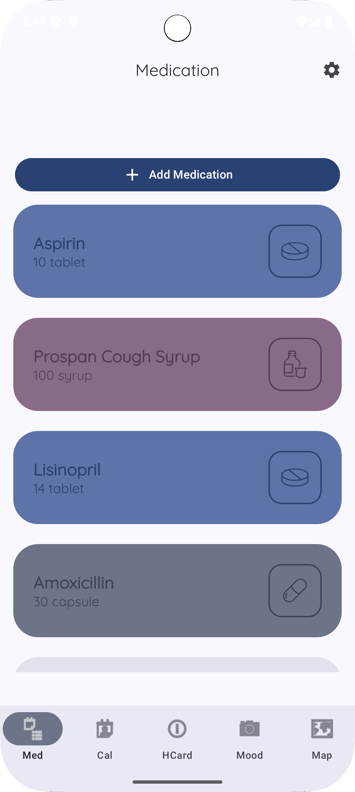
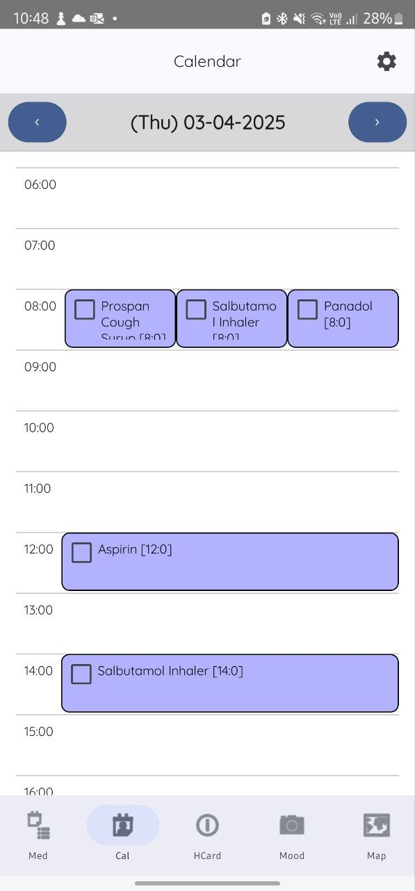
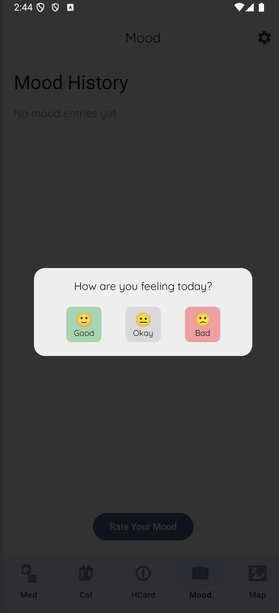
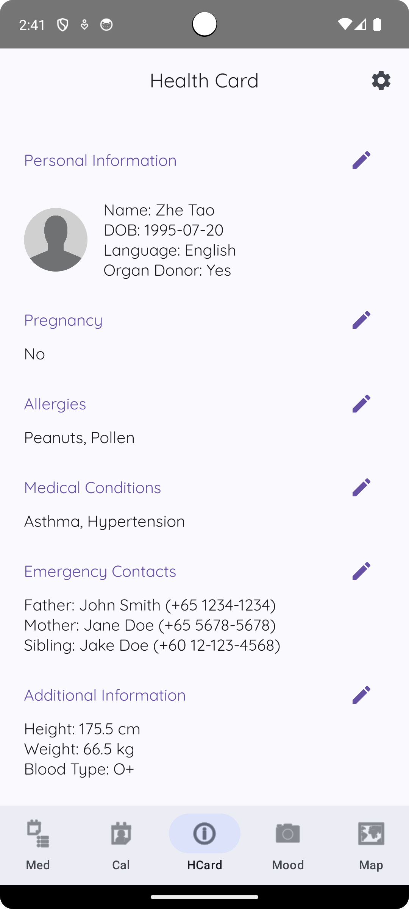

# 💊 CareSync

Caring for someone — or even just yourself — can get overwhelming. Meds get missed, routines break, stress builds.

**CareSync** is a warm, fuss-free app that helps you stay on top of medications with smart reminders and simple tracking. No more guesswork. Just timely nudges, real-time stats, and peace of mind.

Whether you're a patient or a caregiver, CareSync keeps everyone in sync — because taking meds should feel caring, not complicated.

## 🌱 Background

### 💥 Challenge Statement

<table>
  <tr>
    <td></td>
    <td>
      <em>“Half of all patients don’t take their meds as prescribed.”</em> 
      — <strong>World Health Organization</strong>  
      <em>“By 2050, 1 in 5 people will be over 60.”</em> 
      — <strong>United Nations</strong>
    </td>
  </tr>
</table>

> 👵 Aging population.  
> 💊 Rising chronic illnesses.  
> 💔 Missed medications.  
> 👨‍⚕️ Overwhelmed caregivers.

These numbers aren’t just stats—they're **lives** at risk. And that’s where **CareSync** steps in. A gentle nudge. A caring hand. A better way to manage meds.

### 👥 User Need Statements

<table>
  <tr>
    <td>
      
    </td>
    <td>
   <h4>👩‍⚕️ Caregivers</h4>
      <ul>
        <li>Family, nurses, volunteers</li>
        <li>Need visibility into loved ones’ health</li>
        <li>Want to help, but not hover</li>
      </ul>
   <h4>🧓 Care Recipients</h4>
      <ul>
        <li>Older adults or patients with chronic conditions</li>
        <li>Need reminders and routine</li>
        <li>Want autonomy + support</li>
      </ul>
   </td>
  </tr>
</table>

## 🎨 Product Design

### 📦 Product Description

CareSync is a simple yet powerful mobile app that helps patients manage their medications — and lets caregivers stay gently informed. From medication tracking to mood monitoring, CareSync bridges the gap between healthcare needs and human care.

At its heart, CareSync is about timing, trust, and togetherness:

- 💊 Medication Tracking – Patients can log all their medications with dosage and timing details.
- 🔔 Smart Reminders – Users get nudges when it’s time to take their meds.
- 📈 Adherence Analytics – Donut charts and stats show how well patients are following their regimens.
- 😊 Mood Tracking – Users input their daily mood, visualized in a word cloud to spot emotional patterns.
- 🩺 Digital Health Card – Displays allergies, conditions, and medications in one place for emergencies or checkups.
- 🧑‍⚕️ Caregiver Access – Caregivers can view patient profiles, medication logs, and mood summaries.
- 🗺️ Nearby Pharmacies – An integrated map shows where to get medication refills quickly and easily.

Whether you're managing your own care or helping someone else, CareSync brings clarity and calm to daily health routines.

### 🖥️ System Diagram

## ✨ Features & Benefits

| 🧩 Feature             | 📝 Description                                         | 🌟 Benefit                           |
| ---------------------- | ------------------------------------------------------ | ------------------------------------ |
| 💊 Medication Tracking | Users can log medication names, dosages, and schedules | No more missed doses                 |
| 🔔 Smart Reminders     | Timely notifications based on user schedule            | Builds consistent habits             |
| 🧑‍⚕️ Caregiver Access    | Link to a caregiver who can view stats and logs        | Enables remote support               |
| 😊 Mood Tracking       | Daily mood input with cheerful visuals                 | Understands emotional well-being     |
| 🩺 Digital Health Card | Quick overview of meds, allergies, conditions          | Instant info for doctors/emergencies |
| 🗺️ Nearby Pharmacies   | Map view of nearby pharmacies and availability         | Makes refills stress-free            |

<table>
  <tr>
    <td align="center"><b>💊 Medication Tracking</b></td>
    <td align="center"><b>🔔 Smart Reminders</b></td>
    <td align="center"><b>🧑‍⚕️ Caregiver Access</b></td>
  </tr>
  <tr>
    <td></td>
    <td></td>
    <td></td>
  </tr>
  <tr>
    <td align="center"><b>😊 Mood Tracking</b></td>
    <td align="center"><b>🩺 Digital Health Card</b></td>
    <td align="center"><b>🗺️ Nearby Pharmacies</b></td>
  </tr>
  <tr>
    <td></td>
    <td></td>
    <td></td>
  </tr>
</table>

## 🛠️ Prototype Development

### 🧩 Hardware / Software Components

| Component      | Description                                |
| -------------- | ------------------------------------------ |
| 📱 Android App | Built using Jetpack Compose                |
| 🧠 ViewModels  | Handle business logic and state management |
| 🗃️ Room DB     | An abstraction layer over SQLite           |
| 📦 SQLite      | Local data persistence                     |
| 🗺️ Google Maps | Displays nearby pharmacies                 |

### 📁 Code Organization

| **Module**               | **Description**                                                                 |
| ------------------------ | ------------------------------------------------------------------------------- |
| `datasource/`            | 🔌 Handles data access logic like login states and user profiles                |
| `model/`                 | 🧠 Contains data classes, DAOs, Room databases, and repositories                |
| `ui/components/`         | 🎨 Houses UI logic including screens and reusable components                    |
| `ui/screens/`            | 📱 Split into features like `calendar`, `caregiver`, `medication`, `mood`, etc. |
| `ui/theme/`              | 🎨 Manages typography and color schemes                                         |
| `utils/`                 | 🧰 Utility functions and helper files                                           |
| `CareSyncApplication.kt` | 📦 The main application entry point for setup and initialization                |

### 🚀 Setup, Deploy, Operate

1. 🔐 **Add API Keys**

   - Add your `MAPS_API_KEY` in `local.properties`.

2. 🧪 **Run the App**
   - Open in Android Studio
   - `Run > app` or `Shift + F10`

### 🔄 Iterative Implementation Process

We followed an **agile, feedback-first approach** throughout the term:

1. 📅 **Week 1–2**: Brainstormed ideas, finalized problem space
2. 🔍 **Week 3**: Conducted user interviews to understand real needs
3. 🧱 **Week 4–6**: Built core features — medication tracking and reminders
4. 🔗 **Week 7–8**: Integrated caregiver support, mood logs, and healthcard
5. 🧪 **Week 9–10**: Testing, UI polish, responsiveness fixes
6. 🎯 **Final Weeks**: User walkthroughs, documentation, and story video

> 💡 Every week we iterated based on feedback — from peers and profs!

## Glow Up Journey

### Franky

For CareSync, I worked on multiple critical features, starting with the login and registration system, ensuring smooth authentication and persistent login using SharedPreferences. I also built out the Caregiver Access module, which includes viewing patient profiles, tracking medication inventory, and visualizing mood data. This mood charting feature was particularly involved — I integrated a third-party library to display a donut chart and built a custom word cloud from scratch, which required implementing collision detection to avoid overlapping mood bubbles.

Throughout the project, I deepened my knowledge in Jetpack Compose and responsive UI design. I learned how to handle state effectively, structure a scalable project using custom NavHosts for caregivers vs. care recipients, and create responsive layouts that adapt across screen sizes. Developing the mood chart pushed my understanding of positioning and layout constraints, and it was my first time applying collision-detection logic in a UI context — a challenging but very rewarding experience.

What I’m most proud of is how I was able to connect multiple moving parts — from backend data sources to responsive UI and third-party charting tools — into a seamless, cohesive experience. Seeing the caregiver dashboard come to life, and especially getting the word cloud to render just right, felt like a real milestone. This project helped me grow both as a developer and designer, and gave me a chance to turn something complex and technical into something people can intuitively use and feel connected to.

### Jared Choy

I was primarily responsible for the Mood Tracking feature in CareSync. I designed the mood input interface and implemented the modal that allows users to record their emotions. Beyond that, I also took the lead in conceptualizing and directing our story video — crafting the overall narrative, planning out each scene, and making sure it felt engaging and human. I also helped with acting and coordinating filming sessions with the team.

Through this project, I learned how to implement MVVM architecture using Jetpack Compose and gained hands-on experience in managing UI state, ViewModels, and composables. It was my first time working on a full Android app end-to-end, and it gave me a much deeper understanding of how to build features that are modular, testable, and user-friendly. I also grew creatively through directing and scripting the video, which helped me connect software with storytelling.

What I’m most proud of is seeing the mood feature come to life — especially the moment the modal worked smoothly for the first time. It may seem like a small thing, but it made me realize how far I’ve come as a developer. Contributing both to the app and to the video made this project incredibly meaningful, and I’m proud of how I was able to apply both my technical and creative skills to bring CareSync to life.

### Jay

I worked mainly on the HealthCard feature. This included both the UI and data layer for showing user profile info, emergency contacts, and medications. I also handled splitting the profile into editable sections, allowing each one to update independently. This required setting up Room databases, DAOs, and wiring everything through ViewModel and Composables.

One key thing I learnt was how to work with Room databases and how to make sure the data flows properly from the database to the UI using Flow and collectAsState. Debugging state issues and syncing live database values with the UI was a challenge, but I gained a better understanding of Compose’s lifecycle and state management.

I'm most proud of being able to build a modular, reusable edit screen, and getting dynamic updates working across the whole HealthCard. I also helped integrate everything cleanly into the overall project structure. It was really satisfying seeing the entire flow come together — from raw DB to polished UI — and I definitely levelled up in terms of architecture and reactive UI skills.

### Rayner Tan

I worked mainly on the calendar. This lead out to the setting up the data layer for medical dosages and tracking their states. I also did the setup for navigation in the whole project, and also did the setup for the database layer.

The things I've learnt is that to make the jump between mutable states over to view models, and then over to persistent storage is very different, and your previews would break at each step. There are limitations to previews, but it is worth the investment to work around them and still get them somewhat working, as it still speeds up iteration.

I'm quite satisfied that I was able to set up the project with very little overlaps or conflicts between each other's codes in the team. Managed to split up the working files so that there were as little bottlenecks as possible. I'm also quite happy to have been able to help my teammates resolve their threading issues, especially with the room DB layer.

### Wei Jie

I worked mainly on the MapScreen and clinic components. This involved creating interactive and responsive UI components such as expandable clinic cards, integrating dynamic filtering based on stock availability, and setting up real-time location and permission handling for displaying nearby clinics.

Through this project, I learned how to effectively manage UI state in Jetpack Compose, particularly when handling dynamic lists, animations, and interactive components. Handling location permissions and integrating Google Maps API taught me valuable lessons about gracefully managing runtime permissions and user interactions.

I’m most proud of successfully implementing an intuitive and responsive user interface that enhances usability, especially with the smooth card expansion animations and clear visual feedback on clinic stock statuses. Additionally, managing component states and ensuring the UI remains consistent and performant as data changes significantly improved my ability to debug complex interactions. This experience greatly boosted my confidence in handling interactive elements and delivering polished, user-friendly components.

### Zhe Tao
